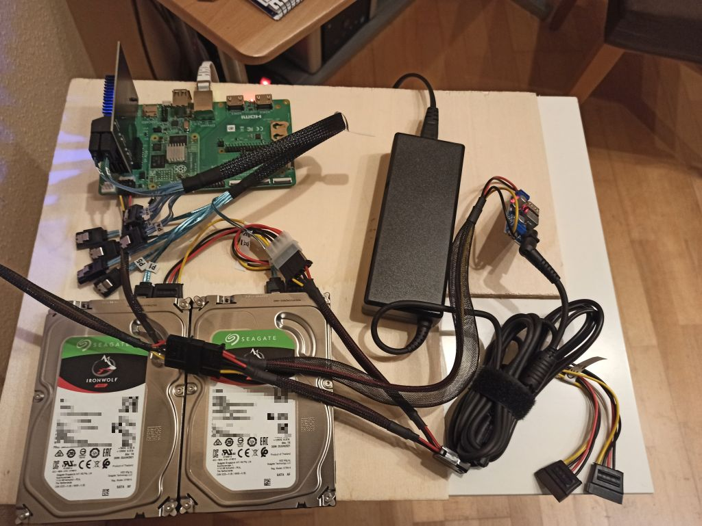

# Introduction
A Raspberry Pi CM4 based NAS for upto 8 SATA drives. 

# Hardware

* Raspberry Pi Compute Module 4 8GB RAM, eMMC
* Raspberry Pi CM IO Board
* PCIe SATA Controller with 4..8 SATA connectors
* 12V/7A Power supply
* 5V/5A Power module
* 1..8 SATA drives
* 1..8 SATA signal cables
* power cable with 1..8 SATA, 1 Floppy connector
* 12V fan
* suitable housing 3D printed or up-cycled PC housing
* optional front panel with display, buttons, LEDs

More details in the [hardware overview](hardware.md)

# Software

* Raspberry Pi OS lite
* Open Media Fault 
* Python script for front panel, display, buttons and fan control

More details in the [software overview](software.md)

